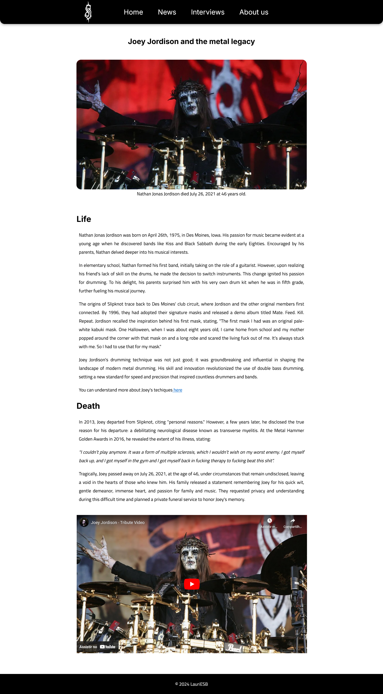

# Joey Jordison and the metal legacy

 

 
 

This is a repository made to upload my result of the second required project of FreeCodeCamp Responsive Web Design course.

## Goal

This second certification project requires the creation of a tribute page, utilizing the knowledge acquired in the course until now (HTML, CSS flexbox and typography), aiming to meet all the tests requirements.

## Results
In this project I talked about Joey Jordison, form Slipknot member and creator, his journey thought music and his influence in metal.

 

Project's screenshot

 

  

 

